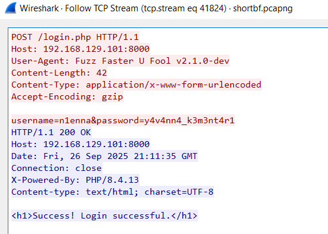
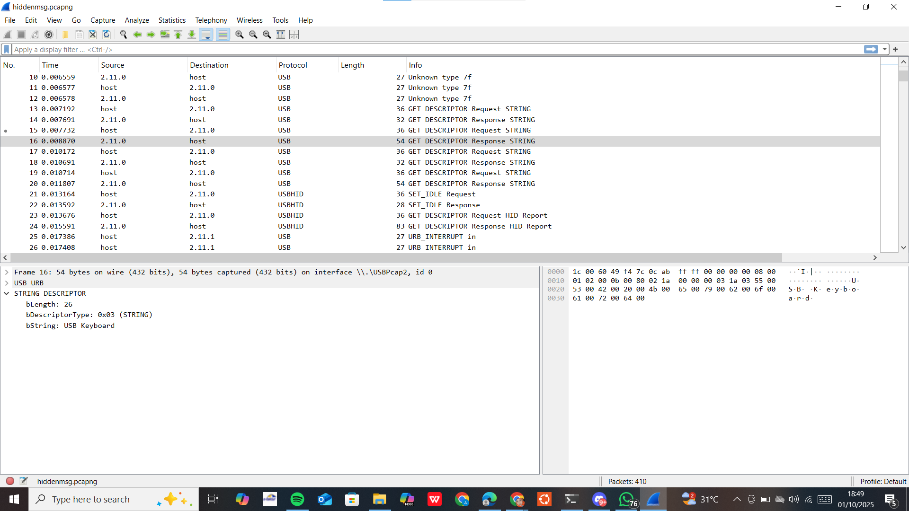
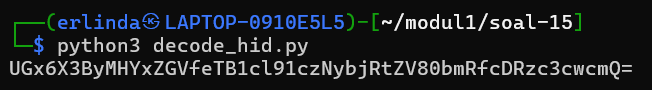
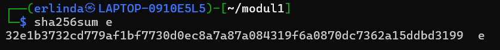
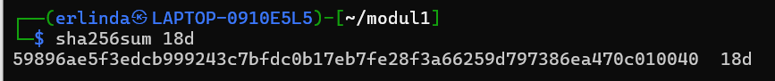

# Jarkom-Modul-1-2025-K57

### Member
1. Prabaswara Febrian 5027241069
2. Erlinda Annisa Zahra 5027241108

### Reporting

## Soal 1
Dalam tahap persiapan jaringan, Eru yang berperan sebagai Router membangun dua buah Switch/Gateway sebagai penghubung utama. Switch pertama dikonfigurasi untuk terhubung dengan dua Ainur, yaitu Melkor dan Manwe, yang berfungsi sebagai client. Sementara itu, Switch kedua diarahkan untuk terhubung dengan dua Ainur lainnya, yakni Varda dan Ulmo, yang juga ditetapkan sebagai client. Dengan rancangan ini, seluruh client dapat berkomunikasi melalui router pusat sehingga alur jaringan menjadi lebih terstruktur dan sesuai dengan topologi yang telah direncanakan.


## Soal 2
Karena pada saat itu Arda (Bumi) masih terisolasi dari dunia luar, Eru memutuskan untuk menambahkan koneksi agar dapat terhubung ke internet. Hal ini dilakukan dengan menghubungkan Router yang dijalankan oleh Eru ke jaringan eksternal sehingga seluruh entitas yang berada di dalam topologi, termasuk para Ainur sebagai client, bisa mengakses layanan internet. Dengan langkah ini, jaringan yang awalnya hanya terbatas pada komunikasi internal kini dapat berinteraksi dengan jaringan global.

## Soal 3
Pada tahap ini, Eru memastikan agar setiap Ainur (Client) dapat saling terhubung. Hal ini dilakukan dengan mengatur konfigurasi jaringan pada Router sehingga komunikasi antar-Client dalam satu topologi dapat berjalan tanpa hambatan. Dengan demikian, semua Ainur bisa melakukan pertukaran data secara langsung melalui jaringan internal.
## Soal 4
Setelah konektivitas internal berhasil, Eru menginginkan agar setiap Ainur (Client) dapat lebih mandiri. Oleh karena itu, konfigurasi dilanjutkan dengan memastikan bahwa setiap Client dapat tersambung ke internet melalui Router. Dengan pengaturan ini, para Ainur tidak hanya dapat berkomunikasi antar satu sama lain, tetapi juga dapat mengakses jaringan eksternal secara bebas.
## Soal 5
Walaupun jaringan sudah berjalan, ancaman dari Melkor sebagai Ainur terkuat tetap ada. Untuk mengantisipasi kerusakan yang mungkin ditimbulkan, Eru bersama Ainur lainnya memastikan bahwa semua konfigurasi yang telah dibuat tidak hilang meskipun node di-restart. Dengan melakukan penyimpanan konfigurasi secara permanen, kestabilan jaringan dapat terjaga dan sistem tetap berjalan sesuai dengan rancangan awal.
## Soal 6
Pertama-tama kita mendownload file traffic.zip dulu, lalu kita unzip di client Manwe, karena dalam konteks soal, Melkor menyusup dalam komunikasi Manwe dan Eru, jadi kita memberi taffic nya kepada Manwe
```
wget --no-check-certificate "https://docs.google.com/uc?export=download&id=1bE3kF1Nclw0VyKq4bL2VtOOt53IC7lG5" -O traffic.zip
unzip traffic.zip -o traffic.sh
bash traffic.sh
```
Lalu kita check link antara switch 1 dengan Eru menggunakan capture di wireshark, lalu kita melakukan filter untuk mengetahui paket mana yang berasal dari atau menuju ke IP Address Manwe.
``
ip.addr == 10.92.1.3
``

## Soal 7 
Pertama-tama kita melakukan persiapan dulu untuk membuat ftp tersebut, karena langkahnya panjang, saya command-command nya dalam satu script file dengan nama setup-ftp.sh
```
apt-get update -y
apt-get install -y vsftpd
mkdir -p /srv/ftp/ainur
mkdir -p /srv/ftp/melkor
groupadd ftpgroup 2>/dev/null
id -u ainur &>/dev/null || useradd -m -d /home/ainur -s /bin/bash -G ftpgroup ainur
echo "ainur:ainur123" | chpasswd
grep /bin/bash /etc/shells || echo "/bin/bash" >> /etc/shells
sed -i '/^ainur$/d' /etc/ftpusers
chown ainur:ftpgroup /srv/ftp/ainur
chmod 770 /srv/ftp/ainur
id -u melkor &>/dev/null || useradd -m -d /home/melkor -s /usr/sbin/nologin melkor
echo "melkor:melkor123" | chpasswd
chown root:root /srv/ftp/melkor
chmod 000 /srv/ftp/melkor
cp /etc/vsftpd.conf /etc/vsftpd.conf.bak 2>/dev/null
cat > /etc/vsftpd.conf <<EOF
listen=YES
listen_ipv6=NO
anonymous_enable=NO
local_enable=YES
write_enable=YES
local_umask=022
dirmessage_enable=YES
use_localtime=YES
xferlog_enable=YES
connect_from_port_20=YES
chroot_local_user=YES
allow_writeable_chroot=YES
user_sub_token=\$USER
local_root=/srv/ftp/\$USER
userlist_enable=YES
userlist_deny=YES
userlist_file=/etc/vsftpd.userlist
pasv_min_port=40000
pasv_max_port=40100
seccomp_sandbox=NO
EOF
echo "melkor" > /etc/vsftpd.userlist
sed -i 's/^auth\s\+required\s\+pam_shells.so/# &/' /etc/pam.d/vsftpd
pkill vsftpd 2>/dev/null
/usr/sbin/vsftpd /etc/vsftpd.conf &
ip addr add 10.15.43.32/24 dev eth1 2>/dev/null
ip link set eth1 up
echo "IP 10.15.43.32 sudah diassign ke eth1 dan interface aktif"
echo "FTP Server setup selesai!"
echo "User ainur (password: ainur123) → read/write di /srv/ftp/ainur"
echo "User melkor (password: melkor123) → tidak bisa akses FTP"
echo "FTP daemon berjalan, siap diakses dari node lain"
```

Lalu kita ganti ke client Ainur (Manwe, Ulno, Varda, Melkor) untuk mengecek apakah ftp dan hak aksesnya berhasil,
untuk ftp yang diberi akses write&read:
``
ftp 10.15.43.32
``
user: ainur, pw: ainur123

Untuk client Melkor yang tidak diberi hak akses caranya sama, namun user dan pw nya beda,
``
ftp 10.15.43.32
``
user: melkor pw: melkor123
# Soal 8
Pertama-tama kita download dulu cuaca.zip nya menggunakan
```
wget --no-check-certificate "https://docs.google.com/uc?export=download&id=11ra_yTV_adsPIXeIPMSt0vrxCBZu0r33" -O cuaca.zip
unzip cuaca.zip -o cuaca.txt
```

Lalu kita masuk ke ftp di client Ulno, dengan 
``user: ainur`` dan ``pw: ainur123``
```
ftp 10.15.43.32 
```
Seletah masuk ke ftpnya, kita upload file tersebut menggunakan
```
put cuaca.txt
```
Setelah itu bari kita bisa mengaksesnya di ftp client Eru dengan menggunakan ``user: ainur`` dan ``pw: ainur123``
```
ftp 10.15.43.32
```
dan mendownload file cuaca.txt nya dnegan
```
get cuaca.txt
```
Kalian bisa mengcapturenya dengan filter ``ftp``
## Soal 9
Petama kita download file tersebut di client Eru dengan cara yang sama seperti sebelumnya, dengan mneggunakan ``wget`` dan ``unzip`` menjadi kitab_penciptaan.txt, setelah itu kita buat aksesnya menjadi ``read-only`` untuk semua ainur
```
chown root:ftpgroup /srv/ftp/ainur/kitab_penciptaan.txt
chmod 444 /srv/ftp/ainur/kitab_penciptaan.txt
chmod 555 /srv/ftp/ainur
```
Lalu kita masuk ke ``ftp 10.15.43.32`` di Eru dan 
```
put kitab_penciptaan.txt
```
Setelah itu kita pindah client ke Manwe dan mendownload filenya dari situ
```
get kitab_penciptaan.txt
```
Kalian bisa mengcapturenya dengan filter ``ftp``

## Soal 10
Masuk ke client melkor dan langsung beri command ping 100 ke node Eru
```
ping -c 100 10.15.43.32
```


## Soal 14
      
      nc 10.15.43.32 3401

a. How many packets are recorded in the pcapng file?
Format: int

bisa dilihat di tengah pojok kanan bawah. Yang bertulis Packets: 500358.


b. What are the user that successfully logged in?
Format: user:pass

Memakai display filter 

      frame contains "Success"

lalu ada muncul 1 paket. klik kanan > follow > tcp stream.

Jawaban 

      n1enna:y4v4nn4_k3m3nt4r1
      



c. In which stream were the credentials found?
Format: int

kita bisa melihat di pojok kiri atas yang highlight berwarna hijau

Jawaban

      41824
      


d. What tools are used for brute force?
Format: Hydra v1.8.0-dev

Dengan paket yang sama seperti no a tadi. klik kanan > follow > tcp stream. lalu bisa melihat User-Agent.

Jawaban 

      Fuzz Faster U Fool v2.1.0-dev
      


## Soal 15

      nc 10.15.43.32 3402

a. What device does Melkor use?
Format: string

Kita bisa scroll kebawah hingga ada tulisan **STRING** karena disoal ada format string. Dan cari di bString yang memiliki kata.

Jawaban 

      Keyboard



b. What did Melkor write?
Format: string

kita disini memakai python3 untuk mendapatkan tulisan yang dibuat melkor. Dimana file decode_hid.py dan file pcapng jadi 1 folder. 
run di terminal: 

      python3 decode_hid.py
      

Jawaban

      UGx6X3ByMHYxZGVfeTB1cl91czNybjRtZV80bmRfcDRzc3cwcmQ=



c. What is Melkor's secret message?
Format: string

Lalu hasil dari yang dapet dari decode bisa dibacakan di website yaitu **cyberchef** dengan recipe From Base46.

Jawaban 

      Plz_pr0v1de_y0ur_us3rn4me_4nd_p4ssw0rd


## Soal 16

      nc 10.15.43.32 3403

a. What credential did the attacker use to log in?
Format: user:pass

Harus mengurutkan sesuai protocol, lalu muncul user > follow > tcp stream

Jawaban

      ind@psg420.com:{6r_6e#TfT1p


b. How many files are suspected of containing malware?
Format: int

untuk ciri ciri malware itu jenis file nya .exe

klik Follow > TCP stream, Didalam itu ada namanya q.exe,w.exe,e.exe,r.exe,t.exe


c.  What is the hash of the first file (q.exe)?
Format: sha256

Clear display filter, lalu scroll ke bawah hingga ketemu q.exe. lalu klik kanan > Follow > tcp stream. Lalu Show As diganti menjadi raw dan save. lalu buka terminal

      sha256sum nama_file

Jawaban 

      ca34b0926cdc3242bbfad1c4a0b42cc2750d90db9a272d92cfb6cb7034d2a3bd


d. What is the hash of the second file (w.exe)?
Format: sha256

lakukan hal sama seperti di C

Jawaban 

      08eb941447078ef2c6ad8d91bb2f52256c09657ecd3d5344023edccf7291e9fc


e. What is the hash of the third file (e.exe)?
Format: sha256

lakukan hal yang sama seperti di C

Jawaban 

      32e1b3732cd779af1bf7730d0ec8a7a87a084319f6a0870dc7362a15ddbd3199



f. What is the hash of the fourth file (r.exe)?
Format: sha256

lakukan hal yang sama seperti di C

Jawaban 

      4ebd58007ee933a0a8348aee2922904a7110b7fb6a316b1c7fb2c6677e613884


g. What is the hash of the fifth file (t.exe)?
Format: sha256

lakukan hal yang sama seperti di C

Jawaban

      10ce4b79180a2ddd924fdc95951d968191af2ee3b7dfc96dd6a5714dbeae613a


## Soal 17

      nc 10.15.43.32 3404

a. What is the name of the first suspicious file?
Format: file.exe

klik File > Export Objects > HTTP. Nah disini ada list listnya.

Jawaban 

      Invoice&MSO-Request.doc


Karena file .doc sering dipakai untuk menyebarkan malware lewat macro atau script berbahaya yang dieksekusi ketika dokumen dibuka.

b. What is the name of the second suspicious file?
Format: file.exe

      knr.exe


c. What is the hash of the second suspicious file (knr.exe)?
Format: sha256

Lalu save, dan membaca ke terminal 

      sha256sum nama_file
      
Jawaban 

      749e161661290e8a2d190b1a66469744127bc25bf46e5d0c6f2e835f4b92db18


## Soal 18 

      nc 10.15.43.32 3405

a. How many files are suspected of containing malware?
Format: int

untuk melihat mencurigakan file malware adalah yang memiliki file .exe

Jawaban 

      2


b.  What is the name of the first malicious file?

Melihat file pertamana yang .exe

Jawaban 

      d0p2nc6ka3f_fixhohlycj4ovqfcy_smchzo_ub83urjpphrwahjwhv_o5c0fvf6.exe


c. Apa nama file berbahaya yang kedua?

melihat file kedua yang .exe

Jawaban 

      oiku9bu68cxqenfmcsos2aek6t07_guuisgxhllixv8dx2eemqddnhyh46l8n_di.exe


d. What is the hash of the first malicious file?
Format: sha256

Bisa mendowload file pertama, lalu bisa memakai terminal:

      sha256sum nama_file
      

Jawaban 

      59896ae5f3edcb999243c7bfdc0b17eb7fe28f3a66259d797386ea470c010040


      
e. What is the hash of the second malicious file?
Format: sha256

Bisa mendowload file Kedua, lalu bisa memakai terminal:

      sha256sum nama_file


Jawaban

      cf99990bee6c378cbf56239b3cc88276eec348d82740f84e9d5c343751f82560


## Soal 19

      nc 10.15.43.32 3406

a. Who sent the threatening message?
Format: string (name)

klik protocol yang SMTP, klik kanan > follow > TCP Stream 

Jawaban

      Your Life
      


b. How much ransom did the attacker demand ($)?
Format: int

Bisa scroll kebawah hingga ketemu gambar dolar($) "To Stop me, Pay exactly 1600$ in bitcoin".


Jawaban

      1600
      

c. What is the attacker's bitcoin wallet?
Format: string

Scroll hingga ketemu text "My bitcoin wallet is: 1CWHmuF8dHt7HBGx5RKKLgg9QA2GmE3UyL"


Jawaban 

      1CWHmuF8dHt7HBGx5RKKLgg9QA2GmE3UyL


## Soal 20

      nc 10.15.43.32 3407

Langkah masukkan keylognya:
1. Edit > Preferences > protocols > pilih TLS
2. Pada opsi (Pre)-Master-Secret log filename Browse dan pilih keyslogfile.txt, lalu pencet ok.
3. Referesh

a. What encryption method is used?
Format: string

Menggunakan display Filter:

      tls.handshake.type == 2

Lalu Klik salah satu paket ServerHelllo > lihat panel tengah > expand Transport Layer Security > bagian cipher suite akan menampilkan nama. 

Jawaban 

      TLS


b. What is the name of the malicious file placed by the attacker?
Format: file.exe

Clear Display filter lalu ke File > Export objects > HTTP, lalu file dengan jenis .dll


c. What is the hash of the file containing the malware?
Format: sha256

Lalu save, dan membaca ke terminal 

      sha256sum nama_file


   
